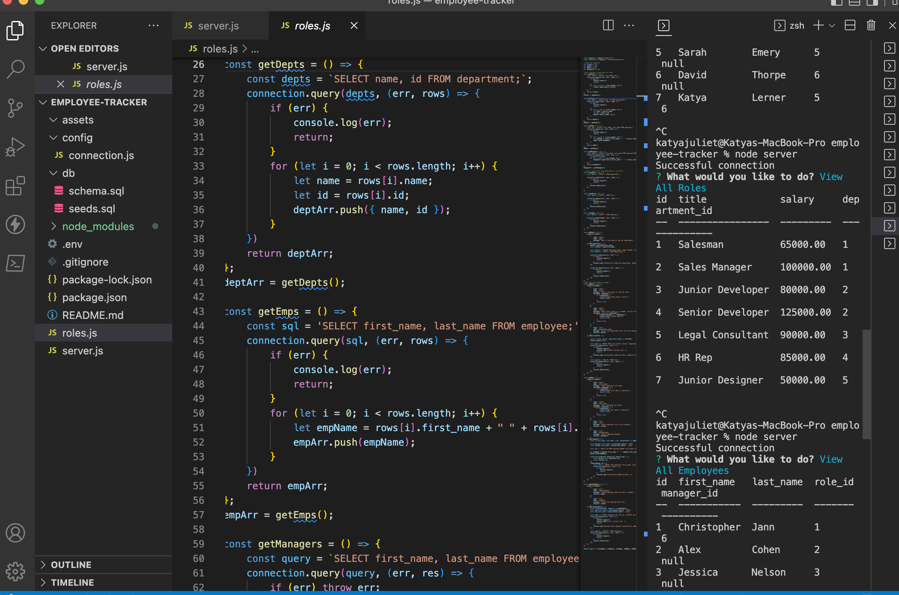
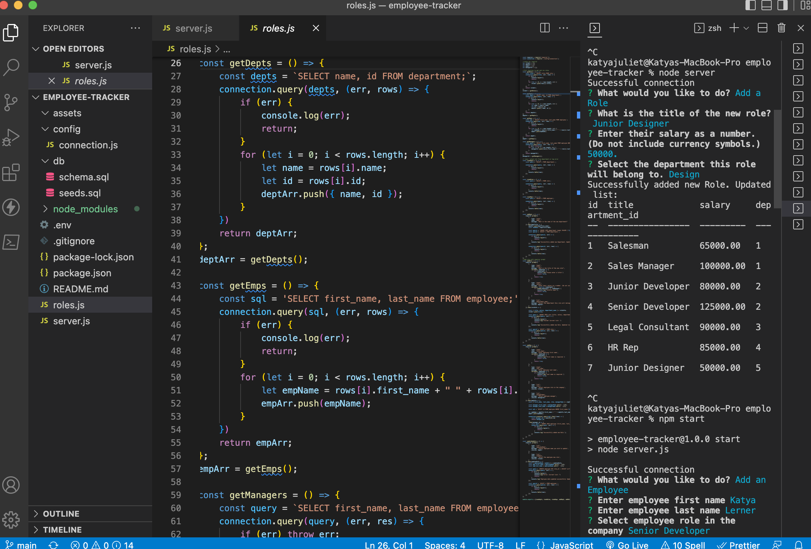

# employee-tracker

## Description
Your assignment this week is to build a command-line application from scratch to manage a company's employee database, using Node.js, Inquirer, and MySQL.

### Installation Guidelines
Clone public repo with "git clone" [link] (https://github.com/katyajuliet/employee-tracker)

run to install the dependencies from package.json
```
npm i or npm install 
```
Required <br>
[Inquirer](https://www.npmjs.com/package/inquirer) <br>
[mysql2](https://www.npmjs.com/package/mysql2) <br>
[console.table](https://www.npmjs.com/package/console.table) <br>
[dotenv](https://www.npmjs.com/package/dotenv) 


#### Video Demonstration on command line and functionality
[Video Demo Link] ()

##### Command Line Screen Shot




